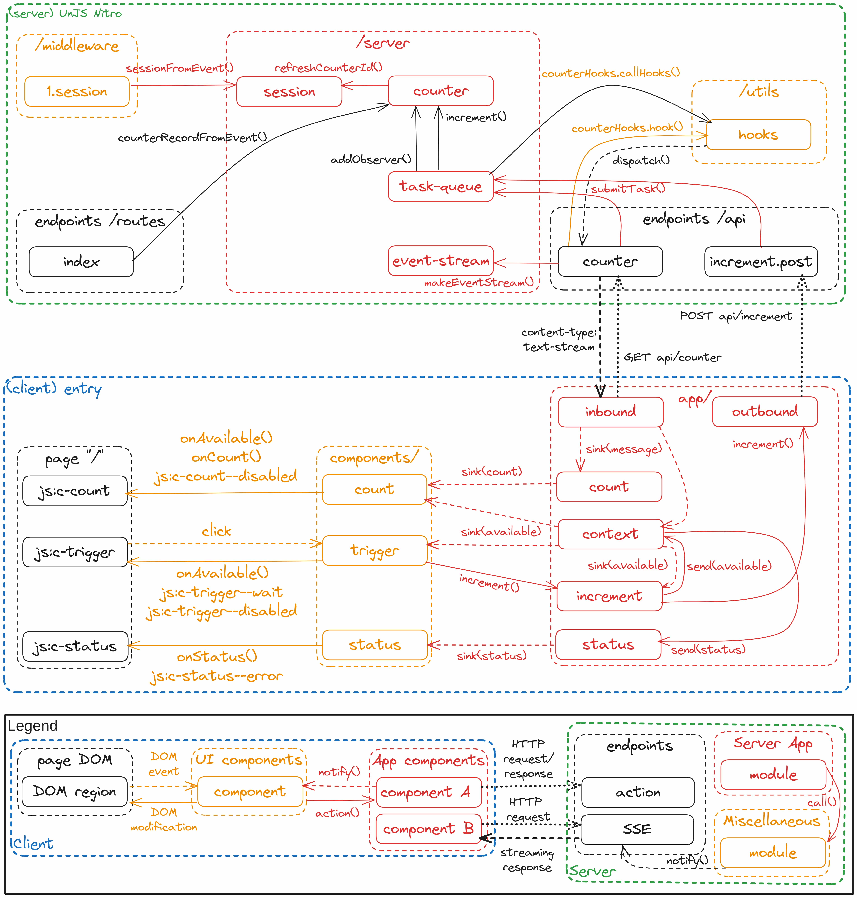
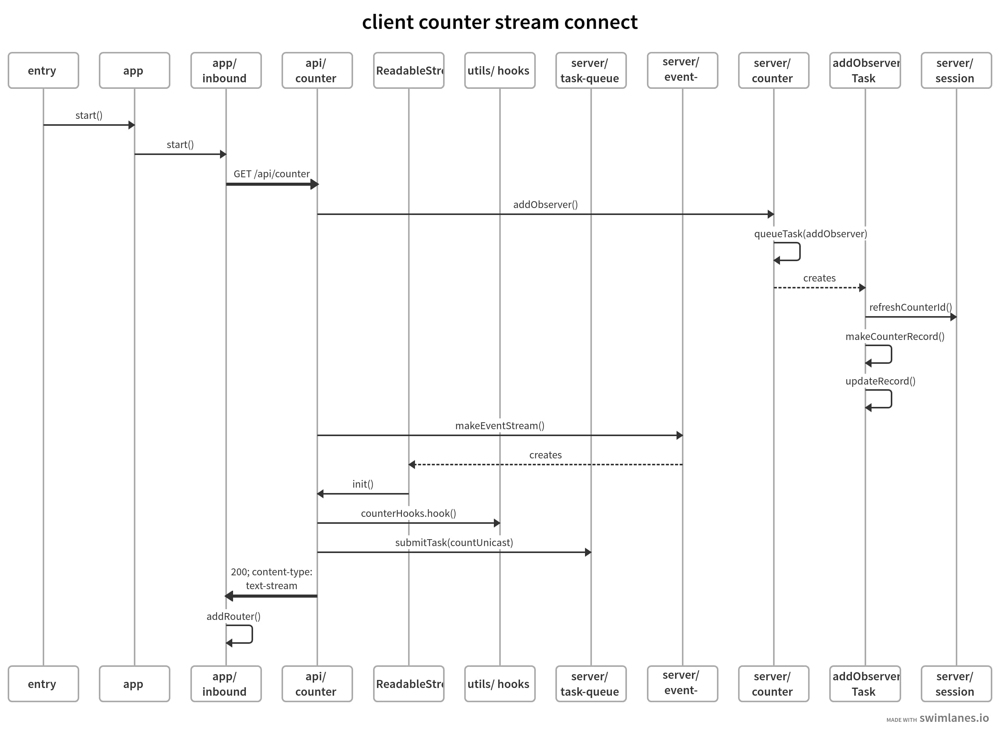
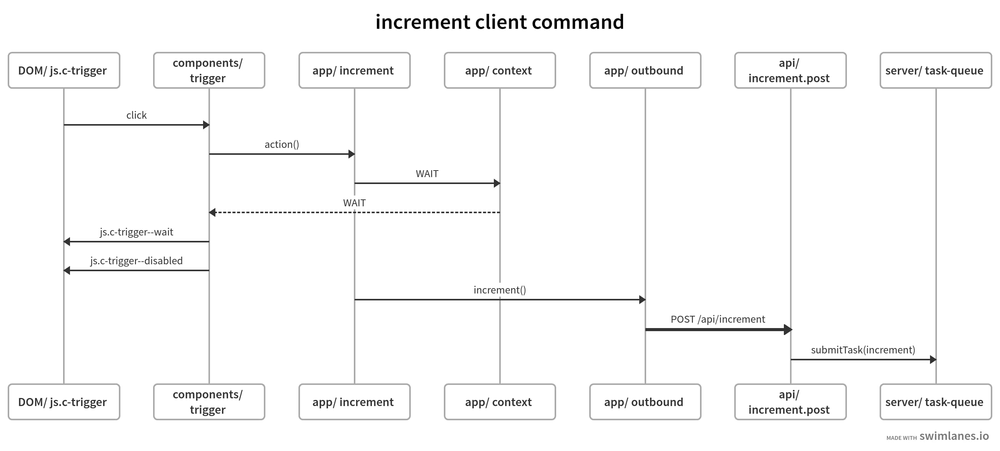
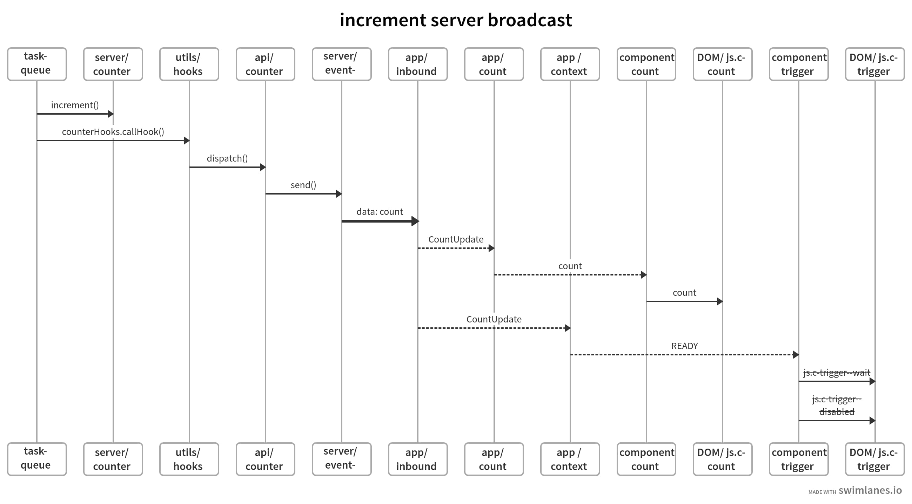

# nitro-sse-counter
SSE POC with UnJS Nitro and a TS JSDoc frontend

… still under construction …









## Server

### Features

- [Middleware](https://nitro.unjs.io/guide/routing#route-middleware) transferring common values from request to [`H3EventContext`](https://www.jsdocs.io/package/h3#H3EventContext).
- [Session](https://www.jsdocs.io/package/h3#Session) cookies with [h3](https://github.com/unjs/h3).
- Shared [data](src/server/counter.ts) managed in server ([memory](https://unstorage.unjs.io/drivers/memory)) [storage](https://nitro.unjs.io/guide/storage) with [Unstorage](https://unstorage.unjs.io/).
- Client specific event dispatchers related to shared server data [managed](src/utils/hooks.ts) with [hooks](https://github.com/unjs/hookable).

### Server to client communication

Though not strictly necessary a [`ReadableStream`](https://developer.mozilla.org/en-US/docs/Web/API/ReadableStream) is returned in the [server-sent events](https://developer.mozilla.org/en-US/docs/Web/API/Server-sent_events/Using_server-sent_events) ([features](https://www.smashingmagazine.com/2018/02/sse-websockets-data-flow-http2/#unique-features)) response to carry the events from the server to the client. The `ReadableStream` is a web standard API and the event stream (mostly) decouples it from the [node specific request API](https://nodejs.org/api/http.html#class-httpincomingmessage).

```TypeScript
// file: src/server/event-stream.ts
import { IncomingMessage } from 'node:http';
import { ReadableStream } from 'node:stream/web';
import { TextEncoder } from 'node:util';

export type SourceController = {
  send: (data: string, id?: string) => void;
  close: () => void;
};

type InitSource = (controller: SourceController) => () => void;

function makeEventStream(request: IncomingMessage, init: InitSource) {
  // listen to the request closing ASAP
  let cleanup: (() => void) | undefined;
  let closeStream: (() => void) | undefined;
  let onClientClose = () => {
    if (onClientClose) {
      request.removeListener('close', onClientClose);
      onClientClose = undefined;
    }
    closeStream?.();
  };
  request.addListener('close', onClientClose);

  return new ReadableStream({
    start(controller) {
      const encoder = new TextEncoder();
      const send = (data: string, id?: string) => {
        const payload = (id ? 'id:' + id + '\ndata:' : 'data:') + data + '\n\n';
        controller.enqueue(encoder.encode(payload));
      };

      closeStream = () => {
        if (!cleanup) return;

        cleanup();
        cleanup = undefined;
        controller.close();
      };
      cleanup = init({ send, close: closeStream });

      if (!onClientClose) {
        // client closed request early
        closeStream();
        return;
      }
    },
  });
}

export { makeEventStream };
```

### SSE Connection Endpoint

The event handler increments the observer count on the counter record. 
The initialization function registers the client event dispatch with the server counter hooks an submits a task to (eventually) send this client the most current count.

The cleanup function is responsible for unregistering the client event dispatch and adjusting the observer count (potentially dropping the counter record).
The cleanup is called when the event stream is closed by either the server or client. 

```TypeScript
// file: src/api/counter.ts
import { CONTEXT_SESSION_ID, refreshCounterId } from '../server/session';
import { makeEventStream, type SourceController } from '../server/event-stream';
import { submitTask } from '../server/task-queue';
import {
  addObserver,
  dropObserver,
  type CountDispatch,
  type CounterRecord,
} from '../server/counter';

function submitCountUnicast(record: CounterRecord, dispatch: CountDispatch) {
  const task = () => {
    dispatch(record.count, record.lastEventId);
  };

  // ejectable by non-ejectable task
  // with same priority (counter) id
  //   i.e. the `increment` will notify the observer
  //   of the latest value already
  //
  submitTask(task, record.id, true);
}

function makeInitFn(record: CounterRecord, sessionId: string) {
  return function init(controller: SourceController) {
    const { send, close } = controller;
    const dispatch = (count: number, id: string) => {
      send(String(count), id);
      if (count > 9) close();
    };
    const unsubscribe = counterHooks.hook(record.id, dispatch);
    submitCountUnicast(record, dispatch);

    return function cleanup() {
      unsubscribe();
      dropObserver(record.id, sessionId);
    };
  };
}

export default defineEventHandler(async (event) => {
  const record = await addObserver(event, refreshCounterId);
  const sessionId = event.context[CONTEXT_SESSION_ID] as string;
  const init = makeInitFn(record, sessionId);

  setHeader(event, 'cache-control', 'no-cache');
  setHeader(event, 'connection', 'keep-alive');
  setHeader(event, 'content-type', 'text/event-stream');
  setResponseStatus(event, 200);

  return makeEventStream(event.node.req, init);
});
```

Every export in the `utils` directory or its subdirectories [becomes available globally](https://nitro.unjs.io/guide/utils).
So `counterHooks` is available throughout the server. 

The ID to a `CounterRecord` is used as the key to `counterHooks`.
This key acts much in the same way as an event `type` identifier (e.g. `click`). 
It allows **multiple** (`CountDispatch`) callbacks to be registered against a single key.

`const unsubscribe = counterHooks.hook(record.id, dispatch)` registers the `dispatch` callback the `record.id` key, returning an `unsubscribe` thunk for unregistering later. 
In the [increment endpoint](#increment-endpoint) `counterHooks.callHook(record.id, record.count, record.lastEventId)` is then used to invoke all `CounterDispatch` callbacks registered against `record.id` with the arguments `(record.count, record.lastEventId)`.

```TypeScript
// file: src/utils/hooks.ts
import { createHooks } from 'hookable';
import type { CountDispatch } from '../server/counter';

export interface CounterHooks {
	[key: string]: CountDispatch;
}

export const counterHooks = createHooks<CounterHooks>();
```


### Session

The session correlates the client to the counter record maintained by the server.
While the counter record is dropped when the last observer closes, the session persist as it may not be possible to update/remove the session cookie on the client at that time.
However when a new record is initialized, the a cookie is updated with a different counter ID.
The session ID is separate from the counter ID; the session record only holds the counter ID needed access the counter record. 

```TypeScript
// file: src/server/session.ts
import crypto from 'uncrypto';
import { updateSession, getSession, type SessionConfig } from 'h3';

import type { EventHandlerRequest, H3Event } from 'h3';

type SessionRecord = {
  counterId: string;
};

const CONTEXT_SESSION_ID = 'session-id';

if (!process.env.SESSION_SECRET) throw Error('SESSION_SECRET must be set');

const config: SessionConfig = {
  cookie: {
    // domain?: string
    // encode?: (value: string) => string;
    // expires?: Date
    httpOnly: true,
    // maxAge?: number
    path: '/',
    sameSite: 'lax',
    secure: true,
  },
  password: process.env.SESSION_SECRET,
  maxAge: 86400, // 24h
  name: '__session',
};

// Note: Despite type, `session.data` may not have `id` property
const sessionFromEvent = (event: H3Event<EventHandlerRequest>) =>
  getSession<SessionRecord>(event, config);

async function refreshCounterId(event: H3Event<EventHandlerRequest>) {
  const counterId = crypto.randomUUID();
  await updateSession(event, config, { counterId });
  return counterId;
}

export { CONTEXT_SESSION_ID, refreshCounterId, sessionFromEvent };
```

Middleware is responsible for creating the session cookie and transferring some request data to the event context.

```TypeScript
// file: src/middleware/1.session.ts
import { CONTEXT_COUNTER } from '../server/counter';
import { CONTEXT_SESSION_ID, sessionFromEvent } from '../server/session';
import { CONTEXT_URL, urlFromRequest } from '../server/url';

export default defineEventHandler(async (event) => {
  const url = urlFromRequest(event.node.req);
  if (url) event.context[CONTEXT_URL] = url;

  const session = await sessionFromEvent(event);
  event.context[CONTEXT_SESSION_ID] = session.id;
  const record = session.data;
  if (record) event.context[CONTEXT_COUNTER] = record.counterId;
});
```

### Task Queue

The task queue manages the event dispatches. 
It is used to eject redundant tasks, i.e. a unicast count update is redundant if an increment to the respective counter is already scheduled or will be scheduled before the entire queue of tasks is run.

For the **same counter** the increment task is considered non-ejectable while a unicast update is ejectable. 
An increment task increments the counter record and notifies all active observers of that record. A unicast update is the initial observer specific event that just communicates the current counter value. 

- An ejectable task can be added as long as no task or only ejectable tasks are on the queue.
- Queuing a **non-ejectable** task will cause all ejectable tasks on the queue to be ejected. 
- Once a **non-ejectable** task is on the queue no other other tasks, ejectable or **non-ejectable**, can be queued until the all the tasks on the queue have run.

The tasks are managed with respect to a priority ID. In this case the counter ID serves as the priority ID.

All active ejectable tasks are on the `taskQueue`. 
The first ejectable `TaskRecord` (for a specific `priorityId`) in the queue acts as the head of a linked list of all ejectable tasks for that particular `priorityId`.
The linked list is traversed when all the ejectable tasks are ejected.
`priorityMap` acts a an index by `priorityId` into the `taskQueue`; it indexes only **non-ejectable** `TaskRecords`s or any ejectable `TaskRecord`s at the head of their respective linked lists. 

```TypeScript
// file: src/server/task-queue.ts
type TaskRecord = {
  task: () => void;
  priorityId: string | undefined;
  eject: boolean;
  next: TaskRecord | undefined;
};

type PriorityMap = Map<string, TaskRecord>;

const RUN_DELAY = 300;

const makeTaskRecord = (
  task: () => void,
  priorityId?: string,
  eject: boolean = false
) => ({ task, priorityId, eject, next: undefined });

let queuedId: ReturnType<typeof setTimeout> | undefined;
const taskQueue: TaskRecord[] = [];

const priorityMap: PriorityMap = new Map();

// Process **everything** on the queue
function runQueue() {
  priorityMap.clear();
  for (let i = 0; i < taskQueue.length; i += 1) taskQueue[i].task();

  taskQueue.length = 0;
  queuedId = undefined;
}

function queueTask(record: TaskRecord) {
  taskQueue.push(record);

  if (typeof queuedId !== 'undefined') return;
  queuedId = setTimeout(runQueue, RUN_DELAY);
}

// For non-ejectable or first ejectable tasks
function queueTaskWithId(record: TaskRecord) {
  priorityMap.set(record.priorityId, record);
  queueTask(record);
}

// For ejectable tasks after the first
function appendEjectable(head: TaskRecord, last: TaskRecord) {
  let record = head;
  for (; record.next; record = record.next);
  record.next = last;

  queueTask(record);
}

function ejectTasks(record: TaskRecord) {
  for (let next = record; next; next = record.next) {
    const index = taskQueue.indexOf(next);
    if (index > -1) taskQueue.splice(index, 1);
  }
}

function submitTask(
  task: () => void,
  priorityId?: string,
  eject: boolean = false
) {
  if (typeof priorityId === 'undefined') {
    queueTask(makeTaskRecord(task));
    return;
  }

  const found = priorityMap.get(priorityId);
  if (!found) {
    queueTaskWithId(makeTaskRecord(task, priorityId, eject));
    return;
  }

  if (!found.eject) {
    // found task will take care of it
    return;
  }

  const record = makeTaskRecord(task, priorityId, eject);

  if (record.eject) {
    appendEjectable(found, record);
    return;
  }

  // new task will replace ejectables
  ejectTasks(found);
  queueTaskWithId(record);
}

export { submitTask };
```

### Counter Management

The `CounterRecords` are managed with the nitro [storage layer](https://nitro.unjs.io/guide/storage) using the default [Unstorage](https://unstorage.unjs.io/) memory [driver](https://unstorage.unjs.io/drivers/memory).

The module exports:
- `addObserver` adds a new `CounterRecord` when there is no counter with a matching `counterId`; otherwise it increments the observer count and updates the stored `CounterRecord`.
- `dropObserver` decrements the observer count and updates the stored `CounterRecord` unless there are no more observers, in which case the `CounterRecord` is removed entirely.
- `increment` increments the count of the `CounterRecord` and updates it.
- `counterRecordFromEvent` retrieves the `CounterRecord` associated with the current session if there is one.

Each of these functions queue a `TaskRecord` on `taskQueue` (distinct from `src/server/task-queue.ts`) in order to prevent racing conditions against a shared record by separate clients. The `TaskRecord`'s is the session ID, **not** counter ID. This makes it possible to queue an `addObserver` task on the queue even in the *absense* of a counter ID (when the `CounterRecord` doesn't yet exist).

To be clear: tasks for different session IDs (different `CounterRecords`) are allowed to execute concurrently. Tasks for the same session ID (same `CounterRecord`) have to run sequentially.

- When a task is added to the `taskQueue` the task isn't run if there already is a task on the queue for the same session ID.
- When the task added is to the queue and it is the first task of that session ID `runTasks` is launched immedately. Once the task completes, the task is removed form the queue and the queue is checked for new tasks belonging to that session ID and if any are found they are run in insertion order. 

`locate` is simply an object with a `withId` and `countWithId` function.
In synchronous code sections it is perfectly safe to set `locate.id` and then use either function in order to avoid creating fresh one off function experessions. 
The [class expession](https://developer.mozilla.org/en-US/docs/Web/JavaScript/Reference/Operators/class) is used to ensure that the [arrow function's](https://developer.mozilla.org/en-US/docs/Web/JavaScript/Reference/Functions/Arrow_functions) `this` refers to the `locate` object.

```TypeScript
// file: src/server/counter.ts
import { CONTEXT_SESSION_ID } from './session';

import type { EventHandlerRequest, H3Event } from 'h3';

type RequestEvent = H3Event<EventHandlerRequest>;

export type CountDispatch = (count: number, id: string) => void;

export type CounterRecord = {
  id: string;
  lastEventId: string;
  count: number;
  observers: number;
};

type TaskRecord = {
  id: string;
  task: () => Promise<void>;
};

// --- Task Queue
const taskQueue: TaskRecord[] = [];

const locate = new (class {
  id = '';
  readonly withId = (record: TaskRecord) => this.id === record.id;
  readonly countWithId = (count: number, record: TaskRecord) =>
    this.id === record.id ? count + 1 : count;
})();

// Continue running until there are no more tasks with the same
// session IDs in taskQueue
async function runTasks(record: TaskRecord) {
  for (
    ;
    typeof record !== 'undefined';
    locate.id = record.id, record = taskQueue.find(locate.withId)
  ) {
    await record.task();

    const index = taskQueue.indexOf(record);
    taskQueue.splice(index, 1);
  }
}

function queueTask(record: TaskRecord) {
  locate.id = record.id;
  const count = taskQueue.reduce(locate.countWithId, 0);
  taskQueue.push(record);

  // Others with identical session ID already running
  if (count > 0) return;

  runTasks(record);
}

// --- Storage Tnteraction
//
const CONTEXT_COUNTER = 'counter';
const STORAGE_COUNTER = 'counter';

const makeCounterRecord = (id: string, lastEventId: string): CounterRecord => ({
  id,
  lastEventId,
  count: 0,
  observers: 1,
});

// inferred return type should also included `undefined`
async function counterRecord(id: unknown): Promise<CounterRecord | void> {
  if (typeof id !== 'string') return undefined;

  return (
    (await useStorage(STORAGE_COUNTER).getItem<CounterRecord>(id)) ?? undefined
  );
}

const removeRecord = (id: string) => useStorage(STORAGE_COUNTER).removeItem(id);

const updateRecord = (record: CounterRecord) =>
  useStorage(STORAGE_COUNTER).setItem<CounterRecord>(record.id, record);

// --- Tasks
//
function counterRecordFromEvent(event: RequestEvent) {
  const id = event.context[CONTEXT_SESSION_ID];
  const counterId = event.context[CONTEXT_COUNTER];
  return new Promise<CounterRecord | void>((resolve, reject) => {
    const task = async () => {
      try {
        const record = await counterRecord(counterId);
        return resolve(record);
      } catch (error) {
        reject(error);
      }
    };

    queueTask({ id, task });
  });
}

function increment(event: RequestEvent) {
  const id = event.context[CONTEXT_SESSION_ID];
  const counterId = event.context[CONTEXT_COUNTER];
  return new Promise<CounterRecord | void>((resolve, reject) => {
    const task = async () => {
      try {
        const record = await counterRecord(counterId);
        if (!record) return resolve(undefined);

        record.count += 1;
        record.lastEventId = String(Date.now());
        await updateRecord(record);
        return resolve(record);
      } catch (error) {
        reject(error);
      }
    };

    queueTask({ id, task });
  });
}

function addObserver(
  event: RequestEvent,
  refreshId: (event: RequestEvent) => Promise<string>
) {
  const id = event.context[CONTEXT_SESSION_ID];
  const counterId = event.context[CONTEXT_COUNTER];
  return new Promise<CounterRecord>((resolve, reject) => {
    const task = async () => {
      try {
        let record = await counterRecord(counterId);
        if (record) {
          record.observers += 1;
        } else {
          const freshId = await refreshId(event);
          record = makeCounterRecord(freshId, String(Date.now()));
        }

        await updateRecord(record);
        return resolve(record);
      } catch (error) {
        reject(error);
      }
    };

    queueTask({ id, task });
  });
}

function dropObserver(counterId: string, id: string) {
  return new Promise<CounterRecord | void>((resolve, reject) => {
    const task = async () => {
      try {
        const record = await counterRecord(counterId);
        if (!record) return resolve(undefined);

        if (record.observers < 2) {
          await removeRecord(record.id);
          return resolve(undefined);
        }

        record.observers -= 1;
        await updateRecord(record);

        return resolve(record);
      } catch (error) {
        reject(error);
      }
    };

    queueTask({ id, task });
  });
}

export {
  CONTEXT_COUNTER,
  addObserver,
  counterRecordFromEvent,
  dropObserver,
  increment,
};
```

### Increment Endpoint

The handler first verifies that the `CounterRecord` exists before it proceeds to submit a task to increment the count and notify all of its observers.
[`callHook`](https://github.com/unjs/hookable#async-callhook-name-args) is used to broadcast the updated count to the observing clients.

```TypeScript
// file: src/api/increment.post.ts
import { submitTask } from '../server/task-queue';
import {
  counterRecordFromEvent,
  increment,
  type CounterRecord,
} from '../server/counter';

import type { EventHandlerRequest, H3Event } from 'h3';

function notifyObservers(record: void | CounterRecord) {
  if (!record) return;

  counterHooks.callHook(record.id, record.count, record.lastEventId);
}

const makeUpdateBroadcast = (event: H3Event<EventHandlerRequest>) => () =>
  increment(event).then(notifyObservers);

export default defineEventHandler(async (event) => {
  const record = await counterRecordFromEvent(event);
  if (!record) {
    sendNoContent(event, 409);
    return;
  }

  // non-ejectable, non-duplicated task
  submitTask(makeUpdateBroadcast(event), record.id);
  sendNoContent(event, 202);
});
```

### Client Page Endpoint

Renders the static HTML portion of the page while injecting the current count of the `CounterRecord` if one already exist. The `CounterRecord` will only be created once the first page's `main.js` script attempts to connect to the [Event Source](https://developer.mozilla.org/en-US/docs/Web/API/EventSource) at `/api/counter`.

```TypeScript
// file: src/routes/index.ts
import { counterRecordFromEvent } from '../server/counter';

export default defineEventHandler(async (event) => {
  const title = 'SSE Counter';
  const record = await counterRecordFromEvent(event);
  const count = record ? String(record.count) : '&nbsp;';

  // prettier-ignore
  return (
    '<!doctype html><html lang="en"><head>' +
      '<meta name="viewport" content="width=device-width, initial-scale=1.0">' +
      `<title>Nitro - ${title}</title>` +
      '<link rel="icon" href="favicon.ico">' +
      '<link href="https://fonts.googleapis.com/css?family=IBM+Plex+Sans:400,600&amp;display=swap" rel="stylesheet">' +
      '<link rel="stylesheet" href="styles.css">' +
      '<script type="module" src="main.js"></script>' +
    '</head><body>' +
      `<h1>${title}</h1>` +
      '<div class="c-counter">' +
        '<dl>' +
          '<dt>Count</dt>' +
          `<dd aria-live="assertive" aria-disabled="false" class="c-counter__count js:c-count">${count}</dd>` +
        '</dl>' +
        '<div class="c-counter__increment">' +
          '<button class="js:c-trigger c-counter__button">Increment</button>' +
          '<p aria-live="assertive" class="js:c-status c-counter__status"></p>' +
        '</div>' +
      '</div>' +
      '<footer>' +
        '<div class="center">' +
          '<p>Served with <a href="https://unjs.io/">UnJS</a> <a href="https://nitro.unjs.io/">Nitro</a>.</p>' +
          '<p>Frontend' +
            '<ul>' +
              '<li>Using <a href="https://github.com/WebReflection/qsa-observer">qsa-observer</a></li>' +
              '<li>Type checked with ' +
                '<a href="https://www.typescriptlang.org/docs/handbook/jsdoc-supported-types.html">TS JSDoc</a>.' +
              '</li>' +
              '<li>Bundled with <a href="https://rollupjs.org/">Rollup</a>.</li>' +
              '<li>Design repurposed from <a href="https://codepen.io/sandrina-p/pen/WNRYabB">here</a>.</li>' +
              '<li>CSS reset from <a href="https://andy-bell.co.uk/a-more-modern-css-reset/">here</a>.</li>' +
            '</ul>' +
          '</p>' +
        '</div>' +
      '</footer>' +
    '</body></html>'
  );
});
```

## Client 

The client application starts with `assembleApp()` which constructs the `inbound` and `outbound` dependencies before injecting them into app factory. Once assembled `hookupUI()` makes it possible for the UI components to connect to the requisite capabilities of the core app.

```JavaScript
// @ts-check
// file: src/client/entry.js

import { define } from './components/registry';
import * as count from './components/count';
import * as status from './components/status';
import * as trigger from './components/trigger';
import { makeInbound } from './app/inbound';
import { makeOutbound } from './app/outbound';
import { makeApp } from './app/index';

/** @typedef { ReturnType<typeof makeApp> } App */

function assembleApp() {
  const inbound = makeInbound('/api/counter');
  const outbound = makeOutbound('/api/increment');
  return makeApp({ inbound, outbound });
}

/** @param { App } app
 * @returns { void }
 */
function hookupUI(app) {
  define(
    count.NAME,
    count.makeSpec(app.subscribeCount, app.subscribeAvailable)
  );
  define(status.NAME, status.makeSpec(app.subscribeStatus));
  define(trigger.NAME, trigger.makeSpec(app.increment, app.subscribeAvailable));
  app.start();
}

hookupUI(assembleApp());
```

### App

#### Core App

The core app consists of four parts:

- `status` The routing point for any status displays to the UI. Any status message to be displayed must go through `status.send()`. `status` is only designed to accept a single observer (the `status` component). 
- `context` The routing point for the current `availableStatus`. Every change must go through `context.sendAvailable()`. The context receives `status` as a dependency as it sends an "error" or "end of count" status display when `availableStatus` becomes `UNAVAILABLE` (due to a `CountError` or `CountEnd` message being received). `context` subscribes to `inbound` for `CountMessage`s; `CountUpdate` messages change the `availableStatus` from `WAIT` to `READY`. `context` is designed to accept multiple observers (`increment`, `trigger` and `count` components). 
- `count` Subscribes to `inbound` messages and processes the `CountUpdate` by updating its single observer (`count` component). 
- `increment` issues an `increment` command to `outbound` right after it sets the `availableStatus` (from `READY`) to `WAIT`. If its command is not `accepted` it switches the `availableStatus` to `UNAVAILABLE`.

The exposed App API consist of:
- `increment` to dispatch an `increment` command.
- `start` to establish the inbound connection.
- `subscribeAvailable` to subscribe to the current `availableStatus`.
- `subscribeStatus` to subscribe to the latest status text.
- `subscribeCount` to subscribe to the latest count.

The App starts out in
- `READY` to issue an increment command
- `WAIT` while waiting for an increment command to complete.
- `UNAVAILABLE` is entered when either an error is encounter while trying to establish a connection or because the count was ended by the server. 

```JavaScript
// @ts-check
// file: src/client/app/index.js
/** @typedef { import('../types').CountSink } CountSink */
/** @typedef { import('../types').AvailableStatus } AvailableStatus */
/** @typedef { import('../types').AvailableSink } AvailableSink */
/** @typedef { import('../types').CountMessage } Message */
/** @typedef { import('../types').Inbound } Inbound */
/** @typedef { import('../types').Outbound } Outbound */
/** @typedef { import('../types').Status } Status */
/** @typedef { import('../types').StatusSink } StatusSink */

import { Sinks } from '../lib/sinks';
import { availableStatus } from './available';

/** @param { Inbound['subscribe'] } subscribe
 * @param { StatusSink } sendStatus
 */
function makeContext(subscribe, sendStatus) {
  /** @type { Status | undefined } */
  let status = {
    error: true,
    message: 'Connection failed. Reload to retry.',
  };
  // Once status is undefined we're done

  /** @type { Sinks<AvailableStatus> } */
  const sinks = new Sinks();

  const context = {
    /** @type { AvailableStatus } */
    available: availableStatus.READY,

    /** @param { AvailableStatus } available */
    sendAvailable: (available) => {
      if (!status) return;

      context.available = available;
      sinks.send(available);

      if (available !== availableStatus.UNAVAILABLE) return;

      // signing off…
      sendStatus(status);
      status = undefined;
      context.unsubscribe();
    },

    /** @param { AvailableSink } sink
     */
    subscribe: (sink) => {
      const unsubscribe = sinks.add(sink);
      sink(context.available);
      return unsubscribe;
    },

    unsubscribe: (() => {
      /** @type { (() => void) | undefined } */
      let remove = subscribe(handler);

      return () => {
        if (!remove) return;
        remove();
        remove = undefined;
      };

      /** @param { Message } message */
      function handler(message) {
        switch (message.kind) {
          case 'end': {
            status = {
              error: false,
              message: 'Count complete. Reload to restart.',
            };
            context.sendAvailable(availableStatus.UNAVAILABLE);
            return;
          }

          case 'error': {
            context.sendAvailable(availableStatus.UNAVAILABLE);
            return;
          }

          default: {
            if (context.available === availableStatus.WAIT)
              context.sendAvailable(availableStatus.READY);
            return;
          }
        }
      }
    })(),
  };

  return context;
}

/** @param { Inbound['subscribe'] } subscribe
 */
function makeCount(subscribe) {
  /** @type { CountSink | undefined } */
  let sink;

  return {
    /** @param { CountSink } nextSink
     * @return { () => void }
     */
    subscribe: (nextSink) => {
      sink = nextSink;
      return () => {
        if (sink === nextSink) sink = undefined;
      };
    },

    unsubscribe: (() => {
      /** @type { (() => void) | undefined } */
      let remove = subscribe(handler);
      return () => {
        if (!remove) return;
        remove();
        remove = undefined;
      };

      /** @param { Message } message */
      function handler(message) {
        if (message.kind === 'update' && sink) sink(message.count);
      }
    })(),
  };
}

/** @param { () => Promise<boolean> } incrementFn
 * @param { AvailableSink } sendAvailable
 */
function makeIncrement(incrementFn, sendAvailable) {
  /** @param { boolean } accepted */
  const postIncrement = (accepted) => {
    if (accepted) return;

    sendAvailable(availableStatus.UNAVAILABLE);
  };

  let done = false;

  const increment = {
    /** @type { AvailableSink } */
    availableSink: (available) => {
      if (done) return;

      if (available === availableStatus.UNAVAILABLE) done = true;
    },

    /** @type { undefined | (() => void)} */
    unsubscribe: undefined,

    dispatch() {
      if (done) return;

      sendAvailable(availableStatus.WAIT);
      incrementFn().then(postIncrement);
    },
  };

  return increment;
}

function makeStatus() {
  /** @type { undefined | StatusSink } */
  let sink;

  const status = {
    /** @param { Status} message
     * @return { void }
     */
    send: (message) => {
      if (sink) sink(message);
    },

    /** @param { StatusSink } nextSink
     * @return { () => void }
     */
    subscribe: (nextSink) => {
      sink = nextSink;
      return () => {
        if (sink === nextSink) sink = undefined;
      };
    },
  };

  return status;
}

/** @param { {
 *   inbound: Inbound
 *   outbound: Outbound
 * } } api
 */
function makeApp({ inbound, outbound }) {
  const status = makeStatus();
  const context = makeContext(inbound.subscribe, status.send);
  const count = makeCount(inbound.subscribe);
  const increment = makeIncrement(outbound.increment, context.sendAvailable);

  // Internal registrations
  increment.unsubscribe = context.subscribe(increment.availableSink);

  return {
    increment: increment.dispatch,
    start: inbound.start,
    subscribeAvailable: context.subscribe,
    subscribeStatus: status.subscribe,
    subscribeCount: count.subscribe,
  };
}

export { makeApp };
```

#### Inbound

The `inbound` module isolates the core's dependency on the browser's [`EventSource`](https://developer.mozilla.org/en-US/docs/Web/API/EventSource).
`eventRouter` is an [`EventListenerObject`](https://github.com/microsoft/TypeScript/blob/2e9e9a292cd10df6ca3425fa4367348067362d53/src/lib/dom.generated.d.ts#L8109-L8111) ([`handleEvent`](https://gist.github.com/WebReflection/35ca0e2ef2fb929143ea725f55bc0d63), [DOM Spec](https://dom.spec.whatwg.org/#interface-eventtarget)) used in lieu of the typical [`EventListener`](https://github.com/microsoft/TypeScript/blob/2e9e9a292cd10df6ca3425fa4367348067362d53/src/lib/dom.generated.d.ts#L8105-L8107) callback function. 

Apart from the `handleEvent(event: Event)` method this particular `EventListenerObject` carries information relevant to the event context: 
- `href` the url to connect the event source
- `source` once the `EventSource` has been connected
- at most one `sink`, a `MessageSink`
- `status` the state of the message connection
  - `undefined` not yet connected
  - `true` connected and operational
  - `false` errored or completed and therefore closed

`makeInbound` exposes two functions:
- `subscribe` to add a `MessageSink` to the `eventRouter`
- `start` to attempt to connect the event source with the configured `href`, later attaching `eventRouter` to the `message` and `error` events, preparing  it to emit `CountMessage`s.

In this simple case the [`MessageEvent`](https://developer.mozilla.org/en-US/docs/Web/API/MessageEvent) will only ever hold the updated count on the [`data`](https://developer.mozilla.org/en-US/docs/Web/API/MessageEvent/data) property and the [`lastEventId`](https://developer.mozilla.org/en-US/docs/Web/API/MessageEvent/lastEventId) property is ignored. In practice any type of serialized `data` (preferably represented via a [discrimated union](https://www.typescriptlang.org/docs/handbook/2/narrowing.html#discriminated-unions)) could be attached. `MessageEvent`s can have [`type`](https://developer.mozilla.org/en-US/docs/Web/API/Event/type)s other than `'message'` for [custom events](https://developer.mozilla.org/en-US/docs/Web/API/Server-sent_events/Using_server-sent_events#listening_for_custom_events). `lastEventId` is usually used implement the ability to catch up on past events after the event source looses the connection and automatically reconnects.

- `dispatchUpdate` sends the updated count to the `Sink<CounterMessage>` as a `CountUpdate`
- `MESSAGE_END` is sent to `Sink<CounterMessage>` when the count finished
- `MESSAGE_ERROR` is sent to `Sink<CounterMessage>` when an error occurs before the connection can be established.

After receiving an error [`Event`](https://developer.mozilla.org/en-US/docs/Web/API/Event) it is assumed that the count has completed if the current `status === true` causing `NESSAGE_END`; otherwise `MESSAGE_ERROR` is sent.
In either case the `eventRouter` is disposed of and cleaned up.

```JavaScript
// @ts-check
// file: src/client/app/inbound.js
/** @typedef { import('../types.ts').CountEnd } CountEnd */
/** @typedef { import('../types.ts').CountError } CountError */
/** @typedef { import('../types.ts').CountMessage } CountMessage */
/** @typedef { import('../types.ts').CountUpdate } CountUpdate */
/** @typedef { import('../types.ts').Inbound } Inbound */
/** @typedef { import('../types.ts').MessageSink } MessageSink */

import { Sinks } from '../lib/sinks';

/** @typedef { EventListenerObject & {
 *   status: undefined | boolean;
 *   href: string;
 *   sinks: Sinks<CountMessage>;
 *   source: void | EventSource;
 * } } HandlerObject */

/** @type { CountEnd } */
const MESSAGE_END = {
  kind: 'end',
};

/** @type { CountError } */
const MESSAGE_ERROR = {
  kind: 'error',
  reason: 'Failed to open connection',
};

/** @param { MessageSink } send
 * @param { MessageEvent<string> } event
 */
function dispatchUpdate(send, event) {
  const count = Number(event.data);
  if (Number.isNaN(count)) return;

  /** @type { CountUpdate } */
  const message = {
    kind: 'update',
    count,
  };
  send(message);
}

/** @param { HandlerObject } router */
function disposeRouter(router) {
  if (router.source) {
    router.source.removeEventListener('message', router);
    router.source.removeEventListener('error', router);
    if (router.source.readyState < 2) router.source.close();
  }
  router.source = undefined;
  router.sinks.clear();
  router.status = false;
}

/** @param { EventSource } source
 * @param { HandlerObject } router
 */
function addRouter(source, router) {
  source.addEventListener('message', router);
  source.addEventListener('error', router);
}

/** @param { string } href
 */
function makeInbound(href) {
  /** @type { HandlerObject } */
  const eventRouter = {
    status: undefined,
    href,
    sinks: new Sinks(),
    source: undefined,
    handleEvent(event) {
      if (this.sinks.size < 1 || this.status === false) return;

      if (event instanceof MessageEvent) {
        this.status = true;
        dispatchUpdate(this.sinks.send, event);
        return;
      }

      if (event.type === 'error') {
        if (this.status === true) {
          this.sinks.send(MESSAGE_END);
        } else {
          this.sinks.send(MESSAGE_ERROR);
        }
        disposeRouter(this);
      }
    },
  };

  const start = () => {
    eventRouter.source = new EventSource(eventRouter.href);
    if (eventRouter.sinks.size > 0) {
      addRouter(eventRouter.source, eventRouter);
    }
  };

  /** @param { MessageSink } sink */
  const subscribe = (sink) => {
    const size = eventRouter.sinks.size;
    const unsubscribe = eventRouter.sinks.add(sink);
    if (size < 1 && eventRouter.source) {
      addRouter(eventRouter.source, eventRouter);
    }

    return unsubscribe;
  };

  /** @type { Inbound } */
  return {
    start,
    subscribe,
  };
}

export { makeInbound };
```

#### Outbound

The `outbound` module isolates the core's dependency on the browser's [`fetch`](https://developer.mozilla.org/en-US/docs/Web/API/fetch). 
The `increment` command simply requests that the count on the counter record currently associated with the client session be incremented. 

A return status of [`202 Accepted`](https://developer.mozilla.org/en-US/docs/Web/HTTP/Status/202) indicates that the task has been queued and will completed *some time soon* (it's complete once the corresponding `MessageEvent` arrives via the [`inbound`](#inbound) event source).

A return status of [`409 Conflict`](https://developer.mozilla.org/en-US/docs/Web/HTTP/Status/409) indicates that the counter identified in the session no longer exists (i.e. there is no one left listening) and that the command cannot be honoured ([`404 Not Found`](https://developer.mozilla.org/en-US/docs/Web/HTTP/Status/404) is more closely associated the resource identified by the url (e.g. `/api/increment`)—given that the out of band session data is considered a different status seemed more appropriate).

In this case the value of the response's [`ok`](https://developer.mozilla.org/en-US/docs/Web/API/Response/ok) property is enough to communicate success or failure of the `increment` command to the core.
 
```JavaScript
// @ts-check
// file: src/client/app/outbound.js

/** @param { string } href
 */
function makeOutbound(href) {
  const increment = async () => {
    const response = await fetch(href, { method: 'POST' });
    return response.ok;
  };

  return {
    increment,
  };
}

export { makeOutbound };
```

### Components

The component modules isolate the core app from the browser's [DOM API](https://developer.mozilla.org/en-US/docs/Web/API/Document_Object_Model). The [`registry`](#registry) handle the component lifecycles.

#### Registry

This simple component registry uses the [`querySelectAll` Observer](https://github.com/WebReflection/qsa-observer) which itself is based on [`MutationObserver`](https://developer.mozilla.org/en-US/docs/Web/API/MutationObserver).

```TypeScript
// file: src/client/types.ts
// … 

/*
  A specification object
  (https://gist.github.com/benpriebe/55b7e950b5e9d056b47e?permalink_comment_id=2229105#gistcomment-2229105)
  is a configurations/customizations "bag" that is passed
  to a factory or builder function to configure and/or
  customize the item under assembly.

  Douglas Crockford also called them _Object Specifiers_
    in _JavaScript: The Good Parts_.

  The term was also used in the original
  (https://shripadk.github.io/react/docs/top-level-api.html#react.createclass)
  React documentation:

      `function createClass(object specification)` Create a component
      given a **specification**. … For more information about
      the **«specification object»**, see Component Specs and Lifecycle
      (https://shripadk.github.io/react/docs/component-specs.html).
*/
export type QsaoSpec = {
  mounted?: (element: Element) => void;
  unmounted?: (element: Element) => void;
};

// … 
```

The `registry` [`Map`](https://developer.mozilla.org/en-US/docs/Web/JavaScript/Reference/Global_Objects/Map) maps a component to its `QsaoSpec`.
The `QsaoSpec` can provide `mounted` and `unmounted` lifecycle functions.
`mounted` is invoked when an element with the registered component `name` in its [`classList`](https://developer.mozilla.org/en-US/docs/Web/API/Element/classList) is inserted in to the DOM.
`unmounted` is invoked when an element with the registered component `name` in its [`classList`](https://developer.mozilla.org/en-US/docs/Web/API/Element/classList) is removed from the DOM.

The `define` function derives a [class selector](https://developer.mozilla.org/en-US/docs/Web/CSS/Class_selectors) from the supplied component name and stores the Qsao lifecycle spec in the `registry` `Map` before applying it to the current DOM state.

```JavaScript
// @ts-check
// file: src/client/components/registry.js

import Qsao from 'qsa-observer';

/** @typedef { import('../types').QsaoSpec } Spec */

// set up component registry
/**  @type { Map<string, Spec> } */
const registry = new Map();
/** @type { string[] } */
const query = [];
const root = self.document;
const qsao = Qsao({
  query,
  root,
  handle(element, mounted, selector) {
    const spec = registry.get(selector);
    if (!spec) return;

    (mounted ? spec.mounted : spec.unmounted)?.(element);
  },
});

/** @param { string} name
 * @param { Spec } spec
 * @return { void }
 */
const define = (name, spec) => {
  const selector = '.' + name;
  if (query.includes(selector)) return;

  query.push(selector);
  registry.set(selector, spec);
  qsao.parse(root.querySelectorAll(selector));
};

export { define };
```

#### Status

The `status` component is the simplest of the components. 
Before it can provide a `QsaoSpec` it needs to be supplied with a means to subscribe to the core app status.
The `makeSpec` [factory function](https://www.javascripttutorial.net/javascript-factory-functions/) takes the required `subscribe` function and returns the `status`'s `QsaoSpec` needed for component registration.

In the `mounted` lifecycle function a `Binder` object is stored in the `instances` [`WeakMap`](https://developer.mozilla.org/en-US/docs/Web/JavaScript/Reference/Global_Objects/WeakMap) against the root element's object reference. The `Binder` holds:
- `root` the element that represents the root of the component inside the DOM.
- `text` the [`Text`](https://developer.mozilla.org/en-US/docs/Web/API/Text) to be updated with the status message (reportedly updating [`nodeValue`](https://developer.mozilla.org/en-US/docs/Web/API/Node/nodeValue) is faster than [`textContent`](https://developer.mozilla.org/en-US/docs/Web/API/Node/textContent))
- `unsubscribe` to remove the subscription to the core app's status message updates.

It's at this point that the component instance subscribes to the core app's status messages which are handled by `onStatus`.
`onStatus` updates the `Text` node referenced in the binder and sets/reset the error class on the root element.

The `unmounted` lifecycle function removes the status subscription and drops the `element`'s `Binder` from the `instances` `WeakMap`.

```JavaScript
// @ts-check
// file: src/client/components/status.ts
/** @typedef { import('../types').QsaoSpec } Spec */
/** @typedef { import('../types').Status } Status */
/** @typedef { import('../types').StatusSink } StatusSink */

/** @typedef { object } Binder
 * @property { HTMLParagraphElement } root
 * @property { Text } text
 * @property { () => void } unsubscribe
 */

const NAME = 'js\\:c-status';
const MODIFIER_ERROR = 'js:c-status--error';
const noOp = () => {};

/** @param { Binder } binder
 * @param { Status } status
 * @return { void }
 */
function onStatus(binder, status) {
  binder.root.classList.toggle(MODIFIER_ERROR, status.error);
  binder.text.nodeValue = status.message;
}

/** @param { (fn: StatusSink) => (() => void) } subscribe
 * @return { Spec }
 */
function makeSpec(subscribe) {
  /** @type { WeakMap<Element, Binder> } */
  const instances = new WeakMap();

  /** @type { Spec } */
  const spec = {
    mounted(element) {
      if (!(element instanceof HTMLParagraphElement)) return;

      const binder = {
        root: element,
        text: new Text(''),
        unsubscribe: noOp,
      };
      binder.root.appendChild(binder.text);
      binder.unsubscribe = subscribe((status) => onStatus(binder, status));

      instances.set(element, binder);
    },
    unmounted(element) {
      const instance = instances.get(element);
      if (!instance) return;

      instance.unsubscribe();
      instances.delete(element);
    },
  };

  return spec;
}

export { NAME, makeSpec };
```

#### Count

The `count` component displays the count but visually also communicates when the count has completed. So `makeSpec` has to be supplied with both `subscribeCount` and `subscribeAvailable` before the `QsaoSpec` needed for registration is produced.

The `mounted` lifecycle function stores a `Binder` object in the `instances` `WeakMap` under the root element's reference.
The `count`'s `Binder` holds:
- `root` the element that acts as the root of the component inside the DOM.
- `text` the `Text` node holding the most recent count value.
- `disabled` reflecting the state of the counter.
- `unsubscribes` an array that holds the `unsubscribe` thunks from `subscribeCount` and `subscribeAvailable`.

The `onAvailable` callback compares the `availableStatus` to the component's `disabled` state. 
`UNAVAILABLE` implies `disabled === true`. 
If the state of `disabled` needs to be synchronized, the value is updated and the `MODIFIER_DISABLED` class is set on the root element accordingly.

The `onCount` callback updates the `text` node to the specified `count`. 

The `unmounted` lifecycle function invokes all the `unsubscribes` thunks and deletes the `Binder` from `instances`.

```JavaScript
// @ts-check
// file: src/client/components/count.ts
/** @typedef { import('../types').QsaoSpec } Spec */
/** @typedef { import('../types').AvailableSink } AvailableSink */
/** @typedef { import('../types').AvailableStatus } AvailableStatus */
/** @typedef { import('../types').CountSink } CountSink */

/** @typedef { object } Binder
 * @property { HTMLElement } root
 * @property { Text } text
 * @property { boolean } disabled
 * @property { (() => void)[] } unsubscribes
 */
import { availableStatus } from '../app/available';

const NAME = 'js\\:c-count';
const MODIFIER_DISABLED = 'js:c-count--disabled';

/** @param { Binder } binder
 * @param { AvailableStatus } status
 * @return { void }
 */
function onAvailable(binder, status) {
	const isDisabled = status === availableStatus.UNAVAILABLE;
	if (binder.disabled === isDisabled) return;

	binder.disabled = isDisabled;
	binder.root.classList.toggle(MODIFIER_DISABLED, isDisabled);
}

/** @param { Binder } binder
 * @param { number } count
 * @return { void }
 */
function onCount(binder, count) {
  if (binder.disabled) return;

  binder.text.nodeValue = String(count);
}

/** @param { Element } root
 * @return { Text }
 */
function ensureTextNode(root) {
  const first = root.firstChild;
  if (first instanceof Text) return first;

  const text = new Text('');
  if (first) {
    root.replaceChild(text, first);
  } else {
    root.appendChild(text);
  }
  return text;
}

/** @param { (fn: CountSink) => (() => void) } subscribeCount
 * @param { (fn: AvailableSink) => (() => void) } subscribeAvailable
 * @return { Spec }
 */
function makeSpec(subscribeCount, subscribeAvailable) {
  /** @type { WeakMap<Element, Binder> } */
  const instances = new WeakMap();

  /** @type { Spec } */
  const spec = {
    mounted(element) {
      if (!(element instanceof HTMLElement)) return;

      const text = ensureTextNode(element);
      /** @type { Binder } */
      const binder = {
        root: element,
        text,
        disabled: element.classList.contains(MODIFIER_DISABLED),
        unsubscribes: [],
      };
      binder.unsubscribes[0] = subscribeCount((count) =>
        onCount(binder, count)
      );
      binder.unsubscribes[1] = subscribeAvailable((status) =>
        onAvailable(binder, status)
      );

      instances.set(element, binder);
    },
    unmounted(element) {
      const instance = instances.get(element);
      if (!instance) return;

      for (const unsubscribe of instance.unsubscribes) unsubscribe();

      instances.delete(element);
    },
  };

  return spec;
}

export { NAME, makeSpec };
```

#### Trigger

The `trigger` component manages the button for the increment command/action. The `MODIFIER_DISABLED` class name relates to the disabled/enabled appearance, while `MODIFIER_WAIT` will further augment the disabled appearance to suggest that it will resolve in time (i.e. show a spinner). `makeSpec` has to be supplied with the `action` function to be invoked on `click` and a `subscribe` function for the `availableStatus` before it can furnish the `QsaoSpec` for component registration. 

The `mounted` lifecycle functon stores a `Binder` object in the `instances` `Weakmap` under the [`HTMLButtonElement`](https://developer.mozilla.org/en-US/docs/Web/API/HTMLButtonElement)'s reference. 
The `trigger`'s `Binder` holds:
- `root` the `HTMLButtonElement` representing the component in the DOM
- `disabled` tracks whether the component is considered "disabled" (which is mirrored in the button's [`aria-disabled`](https://developer.mozilla.org/en-US/docs/Web/Accessibility/ARIA/Attributes/aria-disabled) attribute)
- `click` is the `click` listener that is used by the button element to invoke the `action`
- `unsubscribe` to stop receiving `availableStatus` updates from the core app.

The component subscribes to the app's `availableStatus` updates with the `onAvailable` callback and adds the `click` listener to the button elementi to trigger the `action`.

The `onAvailable` callback synchronizes the button's appearance based on `availableStatus` updates:
- `READY` component **is not** disabled or waiting
- `WAIT` component **is** disabled and waiting (i.e. showing spinner)
- `UNAVAILABLE` component **is** disabled but **is not** waiting (i.e. no spinner)

The `unmounted` lifecycle function removes the `click` listener, `unsubscribe`s from `availableStatus` updates and removes the component's `Binder` from `instances`.

```JavaScript
// @ts-check
// file: src/client/components/trigger.ts
/** @typedef { import('../types').QsaoSpec } Spec */
/** @typedef { import('../types').AvailableStatus } AvailableStatus */
/** @typedef { import('../types').AvailableSink } AvailableSink */

/** @typedef { object } Binder
 * @property { HTMLButtonElement } root
 * @property { boolean } disabled
 * @property { () => void } click
 * @property { () => void } unsubscribe
 */
import { availableStatus } from '../app/available';

const NAME = 'js\\:c-trigger';
const MODIFIER_DISABLED = 'js:c-trigger--disabled';
const MODIFIER_WAIT = 'js:c-trigger--wait';
const noOp = () => {};

/** @param { Binder } binder
 * @param { AvailableStatus } status
 * @return { void }
 */
function onAvailable(binder, status) {
  const [disabled, wait] =
    status === availableStatus.READY
      ? [false, false]
      : status === availableStatus.WAIT
      ? [true, true]
      : [true, false];

  binder.root.classList.toggle(MODIFIER_WAIT, wait);

  binder.disabled = disabled;
  binder.root.classList.toggle(MODIFIER_DISABLED, disabled);
  binder.root.setAttribute('aria-disabled', String(disabled));
}

/** @param { () => void } action
 * @param { (fn: AvailableSink) => (() => void) } subscribe
 * @return { Spec }
 */
function makeSpec(action, subscribe) {
  /** @type { WeakMap<Element, Binder> } */
  const instances = new WeakMap();

  /** @type { Spec } */
  const spec = {
    mounted(element) {
      if (!(element instanceof HTMLButtonElement)) return;

      const binder = {
        root: element,
        disabled: false,
        click: () => {
          if (binder.disabled) return;

          action();
        },
        unsubscribe: noOp,
      };
      binder.unsubscribe = subscribe((status) => onAvailable(binder, status));
      instances.set(element, binder);
      binder.root.addEventListener('click', binder.click);
    },
    unmounted(element) {
      const instance = instances.get(element);
      if (!instance) return;

      instance.unsubscribe();
      instance.root.removeEventListener('click', instance.click);
      instances.delete(element);
    },
  };

  return spec;
}

export { NAME, makeSpec };
```

